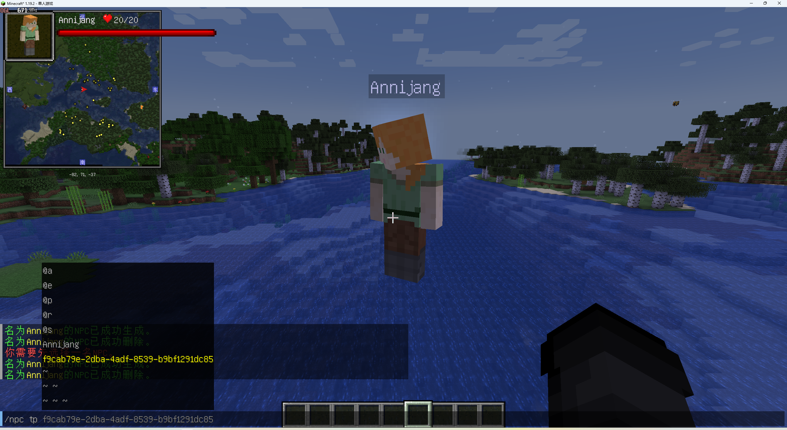

# 行为编辑

---


## 更改行为

???+ "获取UUID"
    获取NPC的UUID最简单的方式是在输入指令时将鼠标准心对着NPC然后就可以在聊天栏中找到UUID。

默认的NPC是[被动](#passive-behaviour)模式。
*~~如果你想更改NPC的行为模式，请继续往下看。~~*

默认情况下，NPC都是无敌的，如果想开启或者关闭NPC的无敌模式，如果需要请在选中NPC后输入以下指令：
```
/data merge entity <NPC的UUID> {Invulnerable:1b}
```

* 1b = true
* 0b = false
* true = 开启，false = 关闭。

## NPC的团队

土豆NPC模组使用了原版的团队系统，有关原版团队的更多信息，请查看[wiki](https://minecraft.fandom.com/zh/wiki/%E5%91%BD%E4%BB%A4/team)。
如果想将NPC添加到一个团队中，请输入以下指令：
```
/team add teamName
/team join teamName <NPC的UUID>
```

同一个团队的NPC**不会攻击同团队中的其他生物或者实体**，但是如果你不在该NPC的团队中，请务必注意安全！

## 敌对行为

*今天是个好日子，直到我输入以下指令*
```
/npc edit behaviour HOSTILE
```
*需要选中NPC后在聊天栏中输入。*

*成功输入后该NPC将会攻击非本团队的生物，为了安全请务必快速远离，否则我可能会成为他们的猎物，**请不要犯傻**，否则你可能会付出血的教训...*

<iframe width="560" height="315" src="https://www.youtube-nocookie.com/embed/i15mTwF14XI" title="YouTube video player" frameborder="0" allow="accelerometer; autoplay; clipboard-write; encrypted-media; gyroscope; picture-in-picture" allowfullscreen></iframe>

## 防御行为

* 防御行为指的是谁攻击了该NPC，那么该NPC将会还击，如果需要请在选中NPC后输入以下指令：
```
/npc edit behaviour DEFENSIVE
```

<iframe width="560" height="315" src="https://www.youtube-nocookie.com/embed/NcajBNITVtc" title="YouTube video player" frameborder="0" allow="accelerometer; autoplay; clipboard-write; encrypted-media; gyroscope; picture-in-picture" allowfullscreen></iframe>

## 友善行为

* 拥有友善行为的NPC会攻击任何靠近的怪物，友善行为指的是对玩家友善，如果需要请在选中NPC后输入以下指令：
```
/npc edit behaviour FRIENDLY
```

<iframe width="560" height="315" src="https://www.youtube-nocookie.com/embed/P32Th75uj4Q" title="YouTube video player" frameborder="0" allow="accelerometer; autoplay; clipboard-write; encrypted-media; gyroscope; picture-in-picture" allowfullscreen></iframe>

## 被动行为

* NPC在生成时默认为被动模式，如果你需要将NPC切换为被动模式请在选中NPC后输入以下指令：
```
/npc edit behaviour PASSIVE
```
被动模式的NPC不会攻击任何生物，不会产生任何的攻击行为。
