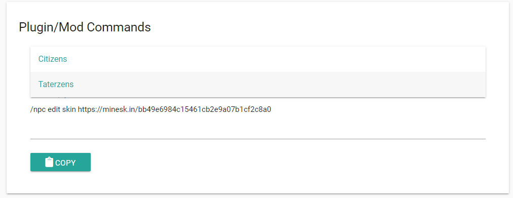

# 更改皮肤
{: width="150px"}

---


## 默认游戏内置皮肤切换

* 根据玩家名称。

本模组允许为NPC设置自定义的皮肤，如果实体[类型](types.md)被设置为玩家`PLAYER`，所有皮肤在设置后都会被**缓存**，这意味着*哪怕皮肤被更改，NPC的皮肤也会始终保持不变*，可以使用以下方法来设置任何我的世界玩家的皮肤：
```
/npc edit skin <我的世界玩家名称>
```

* 来自[mineskin](https://www.mineskin.org)。
	1. 查看[mineskin.org](https://www.mineskin.org)。
	2. 在此网站上上传一个想要的NPC皮肤。
	3. 点击生成的URL饼复制，或者使用鼠标滚轮向下滑并找到`Taterzens`后点击复制指令。
	
	4. 输入指令。
	```
	/npc edit skin <mineskin网站上的URL>
	```
	例如：
	```
	/npc edit skin  https://www.mineskin.org/1234
	```


## 皮肤层
想要将NPC的皮肤设置成自己的，在选中NPC后输入以下指令：
```
/npc edit skin
```
会将你的皮肤设置为该NPC的皮肤。

<iframe width="560" height="315" src="https://www.youtube-nocookie.com/embed/GC2O78TZMy4" title="YouTube video player" frameborder="0" allow="accelerometer; autoplay; clipboard-write; encrypted-media; gyroscope; picture-in-picture" allowfullscreen></iframe>

## 自定义皮肤

*需要搭配mineskin网站使用。*


为了使用此功能，需要安装安装“离线皮肤切换”[Fabric Tailor](https://modrinth.com/mod/FabricTailor)模组。当安装了该模组后，你将允许自定义*选择*并切换NPC皮肤。

当安装了“离线皮肤切换”[Fabric Tailor](https://modrinth.com/mod/FabricTailor)模组后，只需要使用该模组的[`/skin`](https://github.com/samolego/FabricTailor/wiki) 指令即可。
```
/skin set <follow the wiki or brigadier suggestions>
```
